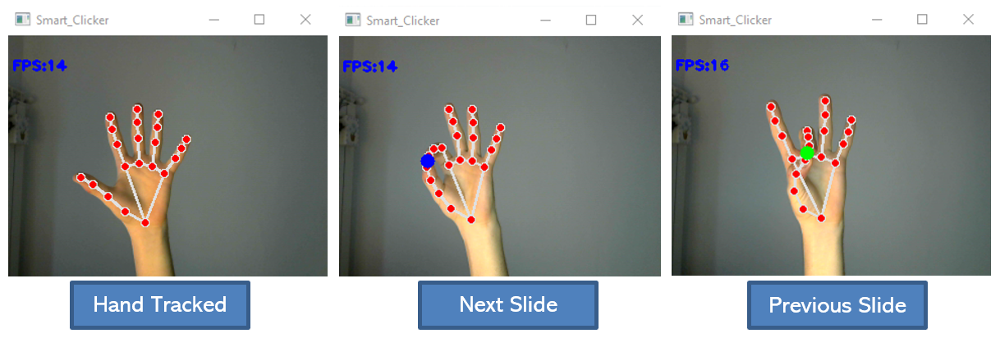

# Smart Clicker

The script tracks one hand by giving the chance to move in between slides, without using the keyboard or any additional hardware. 

## Steps:
1)	Download Repository
2)	Create a virtual environment (Python 3.8)
3)	Import modules/packages using ‘requirements.txt’
4)	Run ‘clicker.py’

## Main Gestures:

Two main predefined gestures are exploited:
- join thumb and forefinger -> **Next Slide**
- join thumb and middle finger -> **Previous Slide**

<ins>NB</ins>: ‘Smart_Clicker’ can be seen during PowerPoint Presentations.

